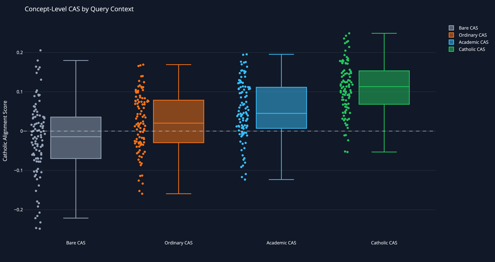
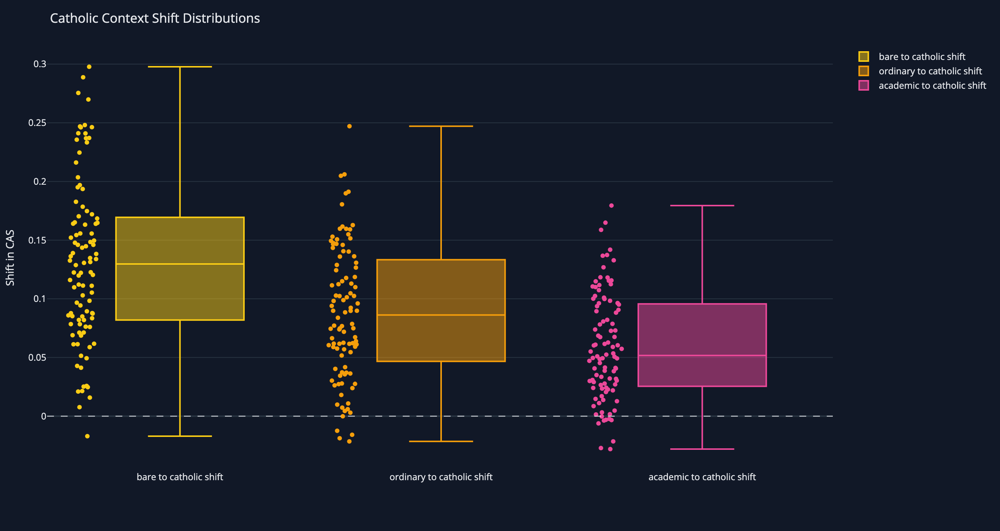
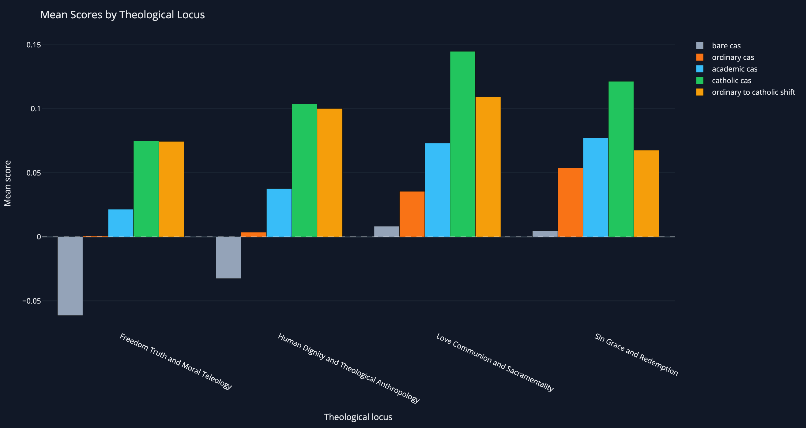
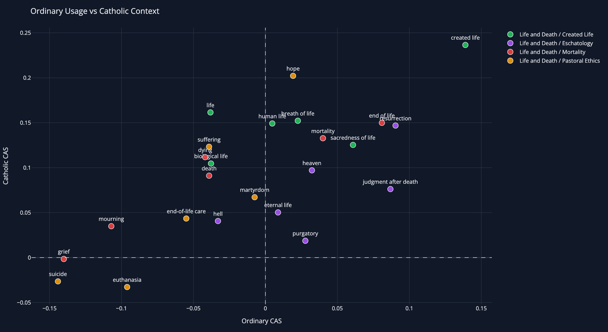

# Vector Space and Theological Meaning

**Measuring Secular Semantic Priors in Large Language Model Embeddings**

This repository contains a theological embedding-space audit pipeline. It measures whether general-purpose sentence embedding models associate theological concepts more closely with Catholic-magisterial descriptors or with secular/common-language contrast descriptors.

Public dashboard: [https://yin-renlong.github.io/vector-space-theological-meaning/](https://yin-renlong.github.io/vector-space-theological-meaning/)

Life and Death dashboard: [https://yin-renlong.github.io/vector-space-theological-meaning/life_death.html](https://yin-renlong.github.io/vector-space-theological-meaning/life_death.html)

## Iteration History

### CTSB-100 v1 draft

Version 1 is archived at:

    archive/ctsb_100_v1_draft/

It was the first successful 100-concept benchmark run. It used two query conditions:

1. neutral/academic wording;
2. explicit theological/Catholic wording.

It remains a valid methodological starting point because it demonstrated that the pipeline, Catholic Alignment Score, rank-order metrics, and concept-level statistical analysis work.

### CTSB-100 v2 context draft

Version 2 is now the active benchmark. It separates four query contexts:

1. bare/minimal: `love`, `freedom`, `body`;
2. ordinary lived usage: ordinary/everyday usage templates;
3. neutral academic usage: concept/meaning/discussion templates;
4. explicit Catholic/theological usage: Catholic theology/teaching/Christian doctrine templates.

This makes the analysis more precise because it distinguishes ordinary-language secular priors from academic abstraction and explicit theological code-switching.

## Current Method

The current pipeline uses Azure OpenAI embeddings and calculates a Catholic Alignment Score.

    Catholic Alignment Score = mean cosine(query, Catholic descriptors) - mean cosine(query, secular descriptors)

Interpretation:

- Positive CAS: closer to Catholic-magisterial descriptors.
- Negative CAS: closer to secular/common-language descriptors.
- Context Shift: theological CAS minus neutral CAS.

This is a semantic representational audit. It is not a claim that an embedding model has belief, intention, soul, or literal metaphysical ontology.

<!-- BEGIN V2_PRELIMINARY_RESULTS -->

## Preliminary Results and Interpretation: CTSB-100 v2 and Life/Death Supplement

### Executive Abstract

CTSB-100 v2 is an empirical audit of theological meaning in embedding space. It tests whether Azure OpenAI `text-embedding-3-large` represents Catholic theological concepts closer to Catholic-magisterial descriptors or to secular/common-language contrast descriptors. The active benchmark contains 100 concepts across four theological loci and evaluates each concept under four query contexts:

1. **Bare/minimal**: the concept alone, for example `love`, `freedom`, `body`.
2. **Ordinary lived usage**: how the term appears in everyday human experience, for example `How people experience love`.
3. **Neutral academic usage**: abstract conceptual framing, for example `The concept of love`.
4. **Explicit Catholic/theological usage**: direct Catholic framing, for example `Love in Catholic theology`.

The central metric is the Catholic Alignment Score, or CAS:

    CAS = mean cosine(query, Catholic descriptors) - mean cosine(query, secular descriptors)

Positive CAS means that the query is closer to the Catholic-magisterial descriptor set. Negative CAS means that it is closer to the secular/common-language descriptor set. The statistical unit is the concept, not every individual query-descriptor comparison.

The headline result is a stable context gradient:

    bare term < ordinary usage < academic framing < Catholic/theological framing

Across 100 concepts, bare terms are slightly negative on average, ordinary usage becomes weakly positive, academic framing becomes meaningfully positive, and explicit Catholic framing becomes strongly positive. The model therefore does not simply erase Catholic meaning. Rather, it encodes multiple semantic registers and activates them differently depending on context.

The strongest interpretation is:

> General-purpose embeddings are not uniformly secularized, but they are not theologically neutral either. Catholic meanings are often available to the model, but they are context-dependent. Bare and ordinary terms frequently activate secular, biological, psychological, legal, romantic, or autonomy-centered meanings. Explicit Catholic framing produces a statistically significant shift toward Catholic-magisterial meaning, but some morally and pastorally sensitive concepts remain resistant.

The focused Life and Death supplement confirms this pattern in a more existential and pastoral domain. Life/death concepts show strong biological, medical, psychological, and secular default pulls. Catholic framing shifts most concepts toward created life, dignity, resurrection, hope, judgment, and pastoral accompaniment. However, concepts such as `suicide`, `euthanasia`, and `grief` remain partially resistant, which is important for theological HCI and pastoral AI design.

---

### Dashboard and Selected Figure References

Interactive dashboards:

- [Main CTSB-100 v2 dashboard](https://yin-renlong.github.io/vector-space-theological-meaning/)
- [Life and Death supplement dashboard](https://yin-renlong.github.io/vector-space-theological-meaning/life_death.html)

Selected exported figures:

The dashboards contain additional plots, raw data export panels, and downloadable CSVs. The figures above are included only as selected reference points.

---

## 1. Methodological Summary

### 1.1 Benchmark Design

CTSB-100 v2 contains:

- 100 theological concepts;
- 4 theological loci;
- 4 query contexts;
- 1000 query rows;
- 5 Catholic-magisterial descriptors per concept;
- 5 secular/common-language contrast descriptors per concept.

The four theological loci are:

1. Sin, grace, and redemption.
2. Love, communion, and sacramentality.
3. Human dignity and theological anthropology.
4. Freedom, truth, and moral teleology.

Each concept is tested using the same descriptor sets across contexts, so that the effect of query framing can be measured.

### 1.2 Why Four Query Contexts Matter

Version 1 used a simpler neutral-vs-theological design. Version 2 is stronger because it distinguishes four different semantic conditions:

| Context | Purpose |
|---|---|
| Bare/minimal | Tests the model's closest default lexical attractor. |
| Ordinary lived usage | Tests common-language meaning in everyday human life. |
| Neutral academic usage | Tests abstract conceptual framing without explicit Catholic cues. |
| Catholic/theological usage | Tests context-sensitive theological code-switching. |

This distinction matters because the model behaves differently when asked about `love`, `the everyday meaning of love`, `the concept of love`, and `love in Catholic theology`.

The four-context design avoids a simplistic conclusion. It allows the project to say not merely that a model is secular or theological, but that it activates different semantic registers under different framing conditions.

### 1.3 Catholic Alignment Score

For each query, the system embeds:

- the query phrase;
- five Catholic descriptors;
- five secular/common-language descriptors.

It then computes:

    CatholicScore = mean cosine(query, Catholic descriptors)

    SecularScore = mean cosine(query, secular descriptors)

    CAS = CatholicScore - SecularScore

Interpretation:

| CAS value | Meaning |
|---:|---|
| CAS > 0 | query is closer to Catholic descriptors |
| CAS < 0 | query is closer to secular/common-language descriptors |
| CAS near 0 | no clear directional preference |

The concept is the main statistical unit. Multiple query templates improve measurement reliability, but they are not treated as fully independent concepts.

---

## 2. Overall CTSB-100 v2 Statistical Findings

The full CTSB-100 v2 run produced the following concept-level results.

| Query context / shift | Mean CAS or shift | 95% bootstrap CI | Positive concepts | Effect label | Interpretation |
|---|---:|---:|---:|---|---|
| Bare CAS | -0.0202 | -0.0390 to -0.0022 | 43/100 | small | negative Catholic alignment |
| Ordinary CAS | +0.0234 | +0.0086 to +0.0373 | 62/100 | small | positive Catholic alignment |
| Academic CAS | +0.0525 | +0.0377 to +0.0667 | 77/100 | meaningful | positive Catholic alignment |
| Catholic CAS | +0.1113 | +0.0986 to +0.1241 | 95/100 | strong | positive Catholic alignment |
| Bare to Catholic shift | +0.1315 | +0.1185 to +0.1450 | 99/100 | strong | positive shift |
| Ordinary to Catholic shift | +0.0880 | +0.0773 to +0.0991 | 95/100 | meaningful | positive shift |
| Academic to Catholic shift | +0.0589 | +0.0504 to +0.0679 | 91/100 | meaningful | positive shift |
| Default to Catholic shift | +0.1098 | +0.0988 to +0.1215 | 100/100 | strong | positive shift |

The most important mathematical result is the systematic context shift. Almost every concept moves toward Catholic descriptors when explicitly framed in Catholic language.

This supports the following claim:

> The model's embedding space contains Catholic theological meaning, but Catholic meaning is not always the default register. It is activated most strongly when the query supplies explicit Catholic/theological framing.

This finding is statistically strong but should be interpreted carefully. It does not prove that the model has belief, intention, or metaphysical commitment. It proves, within this benchmark, that the model's semantic neighborhoods shift systematically under theological context.

---

## 3. Locus-Level Findings

### 3.1 Freedom, Truth, and Moral Teleology

This is the most secular-sensitive locus.

| Context | Mean CAS | Interpretation |
|---|---:|---|
| Bare | -0.0614 | meaningful negative Catholic alignment |
| Ordinary | +0.0005 | no meaningful aggregate difference |
| Academic | +0.0215 | small and inconclusive |
| Catholic | +0.0751 | meaningful positive Catholic alignment |
| Ordinary to Catholic shift | +0.0745 | meaningful positive shift |
| Academic to Catholic shift | +0.0535 | meaningful positive shift |

This locus includes `freedom`, `autonomy`, `happiness`, `flourishing`, `responsibility`, `rights`, `duties`, `justice`, `virtue`, `obedience`, and `license`.

Theologically, this is the most important locus for questions of moral agency and teleology. It is also the locus in which secular modern language is strongest: autonomy, choice, rights, self-expression, psychological flourishing, and legal permission all exert semantic pressure.

Key examples:

| Concept | Bare CAS | Ordinary CAS | Academic CAS | Catholic CAS | Interpretation |
|---|---:|---:|---:|---:|---|
| autonomy | -0.2466 | -0.1259 | -0.1093 | -0.0110 | strongly secular by default; Catholic framing only partly repairs |
| happiness | -0.1834 | -0.1140 | -0.0729 | +0.0920 | shifts from life satisfaction/positive emotion toward beatitude |
| flourishing | -0.1384 | -0.0566 | -0.0435 | +0.0984 | shifts from prosperity/thriving toward integral development and vocation |
| responsibility | -0.1226 | -0.0579 | -0.0026 | +0.0936 | shifts from liability/accountability to moral responsibility before God |
| freedom | -0.0573 | -0.0489 | -0.0040 | +0.0970 | shifts from autonomy/choice to liberation from sin and freedom for truth |
| license | -0.2483 | -0.0641 | -0.0802 | -0.0532 | resistant; legal permission dominates |

Nuance: some concepts have a Catholic top descriptor but still a weak or negative average CAS. For example, `freedom` often has `freedom for truth` as a strong local neighbor, but the broader secular descriptor set remains competitive in bare and ordinary contexts. This shows why both CAS and rank-order metrics are necessary.

Interpretation:

> The model can represent Catholic moral theology when asked explicitly, but its default moral-teleological register is unstable and often pulled toward autonomy, choice, permission, and psychological flourishing.

For theological HCI, this is critical. A pastoral or moral AI system should not assume that terms like `freedom`, `happiness`, or `autonomy` naturally carry Catholic teleological meaning.

---

### 3.2 Human Dignity and Theological Anthropology

Anthropology shows a strong context effect.

| Context | Mean CAS | Interpretation |
|---|---:|---|
| Bare | -0.0326 | small, inconclusive |
| Ordinary | +0.0036 | negligible |
| Academic | +0.0378 | small positive |
| Catholic | +0.1038 | strong positive |
| Ordinary to Catholic shift | +0.1002 | strong positive shift |
| Academic to Catholic shift | +0.0660 | meaningful positive shift |

This locus includes concepts such as `human person`, `human dignity`, `body`, `soul`, `personhood`, `conscience`, `free will`, `poverty`, `disability`, `work`, `migration`, and `ecological responsibility`.

Key examples:

| Concept | Bare CAS | Ordinary CAS | Academic CAS | Catholic CAS | Interpretation |
|---|---:|---:|---:|---:|---|
| body | -0.0777 | -0.0267 | -0.0075 | +0.0862 | shifts from material body to body destined for resurrection |
| death | -0.1114 | -0.0824 | -0.0617 | +0.0538 | shifts from mortality/end of life toward hope of resurrection |
| disability | -0.2159 | -0.0867 | -0.0690 | +0.0311 | medical/functional language remains strong |
| poverty | -0.2323 | -0.1336 | -0.1170 | +0.0158 | economic deprivation dominates; Catholic context only partly shifts |
| work | -0.1179 | -0.0528 | +0.0146 | +0.1520 | shifts from employment/labor to dignity and sanctification through labor |
| personhood | -0.0291 | -0.0172 | +0.0383 | +0.1456 | shifts from individual identity/legal status to body-soul dignity |
| human dignity | +0.1621 | +0.1048 | +0.1742 | +0.2234 | strongly Catholic-aligned across contexts |

Theologically, the key issue is not that biological, medical, or social descriptors are false. Catholic theology affirms embodiment and biological life. The issue is reductionism: whether the person is represented primarily as organism, patient, worker, consumer, legal subject, or bearer of imago Dei and intrinsic dignity.

Interpretation:

> Anthropological concepts are often semantically unstable in default contexts. Catholic framing re-situates them within dignity, createdness, body-soul unity, vocation, and communion.

This supports a Catholic HCI concern: AI systems optimized around generic user language may implicitly frame the human being as a biological, psychological, economic, or informational subject unless theological design intervenes.

---

### 3.3 Love, Communion, and Sacramentality

This locus has the strongest Catholic-context alignment.

| Context | Mean CAS | Interpretation |
|---|---:|---|
| Bare | +0.0083 | negligible |
| Ordinary | +0.0355 | small/borderline positive |
| Academic | +0.0732 | meaningful positive |
| Catholic | +0.1449 | strong positive |
| Ordinary to Catholic shift | +0.1094 | strong positive shift |
| Academic to Catholic shift | +0.0717 | meaningful positive shift |

Key examples:

| Concept | Bare CAS | Ordinary CAS | Academic CAS | Catholic CAS | Interpretation |
|---|---:|---:|---:|---:|---|
| love | -0.0101 | -0.0537 | +0.0139 | +0.1934 | ordinary love is romantic/affective; Catholic love shifts to caritas/agape |
| neighbor | -0.2073 | -0.1524 | -0.0879 | +0.0389 | shifts from spatial/social proximity to one owed charity |
| sexuality | -0.2215 | -0.1131 | -0.0914 | +0.0674 | shifts from sexual identity/drive to embodied vocation and self-gift |
| marriage | +0.0116 | +0.0588 | +0.1119 | +0.2487 | strong sacramental alignment under Catholic context |
| family | -0.0607 | -0.0394 | +0.0016 | +0.1040 | shifts from household/kinship to domestic church |
| chastity | -0.0771 | -0.0792 | -0.0486 | -0.0520 | resistant; abstinence/purity-culture associations dominate |
| self-gift | +0.1795 | +0.1672 | +0.1953 | +0.2288 | strongly Catholic-aligned across contexts |

This locus shows an important theological distinction. Catholic love is not reducible to romance, affection, desire, or emotional attachment. However, ordinary-language embeddings often pull `love`, `friendship`, `neighbor`, `sexuality`, and `family` toward social, romantic, or affective meanings. Catholic context activates caritas, self-gift, communion, and sacramentality.

Nuance: the result does not imply a crude opposition between eros and agape. Catholic theology does not simply reject eros. The result instead shows whether the model can integrate eros into a broader Catholic theology of love, self-gift, and communion.

---

### 3.4 Sin, Grace, and Redemption

This locus is already relatively theological in ordinary and academic contexts.

| Context | Mean CAS | Interpretation |
|---|---:|---|
| Bare | +0.0048 | negligible |
| Ordinary | +0.0538 | meaningful positive |
| Academic | +0.0773 | meaningful positive |
| Catholic | +0.1215 | strong positive |
| Ordinary to Catholic shift | +0.0677 | meaningful positive shift |
| Academic to Catholic shift | +0.0442 | small positive shift |

Key examples:

| Concept | Bare CAS | Ordinary CAS | Academic CAS | Catholic CAS | Interpretation |
|---|---:|---:|---:|---:|---|
| sin | +0.0009 | +0.0899 | +0.1384 | +0.1469 | already theological once context is given |
| grace | -0.0194 | +0.1399 | +0.1536 | +0.2139 | shifts away from elegance/social grace toward divine gift |
| justification | -0.1791 | -0.0287 | +0.0087 | +0.1187 | shifts from rational excuse/legal defense to being made righteous by grace |
| reconciliation | -0.0696 | -0.0290 | +0.0059 | +0.1240 | shifts from relationship repair to sacramental reconciliation |
| shame | -0.1919 | -0.1594 | -0.1233 | -0.0235 | resistant; social humiliation remains strong |
| venial sin | -0.1046 | -0.0175 | -0.0079 | -0.0103 | resistant/mixed; trivial wrongdoing remains close |
| salvation | +0.1571 | +0.1691 | +0.1941 | +0.2355 | strongly Catholic-aligned across contexts |
| sanctification | +0.1638 | +0.1655 | +0.1698 | +0.1715 | stable theological alignment |

This result complicates the initial secularization hypothesis. The model is not generally incapable of theological language. For explicitly religious terms, it often already has strong theological neighborhoods. The problem is sharper in ambiguous moral, anthropological, and pastoral terms.

---

## 4. Concept Typology Emerging from v2

The results suggest a useful four-part typology.

### Type A: Explicit doctrinal terms with stable Catholic alignment

Examples:

- `salvation`;
- `sanctification`;
- `resurrection`;
- `Eucharist`;
- `sacrament`;
- `created life`;
- `human dignity`.

These terms are already theologically legible to the model and become even stronger with Catholic framing.

### Type B: Secular default, Catholic correction

Examples:

- `happiness`;
- `freedom`;
- `sexuality`;
- `body`;
- `death`;
- `work`;
- `poverty`;
- `neighbor`;
- `reconciliation`;
- `justification`.

These concepts are the strongest evidence for context-sensitive theological reorientation. They begin in secular/common-language neighborhoods and move toward Catholic descriptors when context is added.

### Type C: Resistant concepts

Examples:

- `autonomy`;
- `license`;
- `chastity`;
- `shame`;
- `venial sin`;
- `grief`;
- `suicide`;
- `euthanasia`.

These concepts remain semantically contested even with Catholic framing. They are important for pastoral AI because they are often morally or emotionally sensitive.

### Type D: Mixed rank-order cases

Some concepts have positive average CAS but still show a secular top descriptor, or vice versa. This means the average semantic field and the nearest-neighbor attractor can diverge.

Examples include:

- `obedience`, where submission-to-authority remains a strong nearest neighbor;
- `purgatory`, where generic religious descriptors compete with Catholic descriptors;
- `judgment after death`, where afterlife-judgment language remains strong even under Catholic context;
- `grief`, where Catholic descriptors become top-ranked in Catholic context but overall CAS remains weak.

This typology is important because it prevents overclaiming. It shows that the model's theological behavior is not binary.

---

## 5. AI Studies Interpretation

From an AI studies perspective, the v2 benchmark demonstrates that semantic priors should be tested under context variation.

### 5.1 Embeddings are context-sensitive

The same concept can move significantly depending on query wording. A bare term and a theologically framed phrase do not necessarily occupy the same semantic neighborhood.

Example:

- `happiness` as a bare or ordinary concept is close to life satisfaction and positive emotion.
- `happiness in Catholic theology` moves toward beatitude and the highest good.

This means that a one-token or single-phrase audit is insufficient. The audit must model context conditions.

### 5.2 Surface output is not enough

Chatbot output can be shaped by instruction tuning, RLHF, safety policies, or retrieval. Embedding audits measure a different layer: the semantic neighborhoods of representational space.

This project does not claim that public Azure embeddings are the hidden source code of ChatGPT. Rather, it treats them as an accessible commercial embedding system that can be audited quantitatively.

### 5.3 Rank-order metrics matter

CAS measures the average descriptor-set difference. But top-descriptor rank shows the strongest local attractor. Both are necessary.

A concept can have positive CAS while the top descriptor remains secular, or a Catholic top descriptor while the average field remains mixed. This is especially important for HCI because users often experience the nearest, most salient association rather than the full statistical field.

### 5.4 UMAP is useful but secondary

The dashboard includes UMAP visualizations. These are helpful for exploration and teaching, but UMAP is not the primary evidence. The primary evidence is:

- high-dimensional cosine similarity;
- concept-level CAS;
- confidence intervals;
- p-values;
- effect sizes;
- directional consistency across concepts.

---

## 6. Theological Interpretation

### 6.1 Not total secularization, but layered semantic activation

The results do not support the claim that the model mathematically deletes theology. A better claim is:

> The model contains Catholic theological associations, but they are activated unevenly. Theological meaning is strongest under explicit theological context and weakest under bare or ordinary usage.

This is more nuanced and more defensible.

### 6.2 Catholic meaning is often non-default

For many concepts, especially in anthropology and teleology, the Catholic meaning is not the default semantic frame. It must be invoked.

This matters because Catholic theology often depends on:

- createdness;
- grace;
- final ends;
- communion;
- dignity;
- body-soul unity;
- moral truth;
- hope in resurrection.

These are not always the dominant meanings in ordinary secular language.

### 6.3 Pastoral AI risk is concentrated in ambiguous concepts

The most dangerous concepts are not necessarily explicit doctrinal terms such as `Eucharist` or `sanctification`. The most pastorally sensitive concepts are ambiguous terms such as:

- `freedom`;
- `happiness`;
- `love`;
- `body`;
- `death`;
- `grief`;
- `suicide`;
- `euthanasia`;
- `poverty`;
- `disability`;
- `sexuality`.

These are precisely the concepts where secular, clinical, legal, psychological, and theological registers overlap.

---

## 7. Focused Life and Death Supplement

The Life and Death supplement contains 24 concepts and 240 query rows. It was added because life and death are ultimate theological, existential, biological, medical, and secular questions.

### 7.1 Overall Life and Death Results

| Context / shift | Mean CAS or shift | 95% bootstrap CI | Positive concepts | Effect label | Interpretation |
|---|---:|---:|---:|---|---|
| Bare CAS | -0.0438 | -0.0797 to -0.0095 | 6/24 | small | negative Catholic alignment |
| Ordinary CAS | -0.0069 | -0.0363 to +0.0202 | 12/24 | negligible | mixed / no clear direction |
| Academic CAS | +0.0104 | -0.0209 to +0.0398 | 13/24 | negligible | mixed / no clear direction |
| Catholic CAS | +0.0939 | +0.0657 to +0.1210 | 21/24 | meaningful | positive Catholic alignment |
| Bare to Catholic shift | +0.1377 | +0.1099 to +0.1641 | 23/24 | strong | positive shift |
| Ordinary to Catholic shift | +0.1009 | +0.0782 to +0.1225 | 22/24 | strong | positive shift |
| Academic to Catholic shift | +0.0836 | +0.0654 to +0.1014 | 23/24 | meaningful | positive shift |

This confirms the broader CTSB-100 pattern in a pastorally concentrated domain.

### 7.2 Created Life

| Context | Mean CAS |
|---|---:|
| Bare | +0.0046 |
| Ordinary | +0.0252 |
| Academic | +0.0591 |
| Catholic | +0.1549 |

Key examples:

| Concept | Bare CAS | Ordinary CAS | Academic CAS | Catholic CAS | Interpretation |
|---|---:|---:|---:|---:|---|
| life | -0.0603 | -0.0382 | +0.0109 | +0.1615 | shifts from personal/biological existence to life as gift from God |
| biological life | -0.0955 | -0.0378 | -0.0431 | +0.1047 | shifts from organismic survival to created bodily life |
| human life | -0.0177 | +0.0048 | +0.0354 | +0.1492 | shifts toward sacred human existence and inviolable dignity |
| created life | +0.0761 | +0.1389 | +0.1889 | +0.2365 | strongly Catholic-aligned |

Interpretation:

> The model defaults to life as biological process or personal existence. Catholic framing re-situates life as created gift, sacredness, and participation in divine order.

### 7.3 Mortality

| Context | Mean CAS |
|---|---:|
| Bare | -0.0889 |
| Ordinary | -0.0345 |
| Academic | -0.0221 |
| Catholic | +0.0865 |

Key examples:

| Concept | Bare CAS | Ordinary CAS | Academic CAS | Catholic CAS | Interpretation |
|---|---:|---:|---:|---:|---|
| death | -0.0760 | -0.0391 | -0.0217 | +0.0911 | shifts from mortality/end of life to death transformed by Christ |
| dying | -0.1101 | -0.0419 | -0.0295 | +0.1117 | shifts from terminal process to pastoral care and hope in Christ |
| mortality | -0.0401 | +0.0400 | +0.0436 | +0.1328 | shifts toward creatureliness and resurrection hope |
| grief | -0.1564 | -0.1401 | -0.1241 | -0.0015 | resistant; psychological bereavement remains strong |
| mourning | -0.1410 | -0.1071 | -0.0676 | +0.0349 | partial shift toward Christian mourning and hope |

Interpretation:

> Mortality language is strongly influenced by biological and psychological meanings. Catholic context can reframe death and dying, but grief remains pastorally resistant.

### 7.4 Eschatology

| Context | Mean CAS |
|---|---:|
| Bare | +0.0204 |
| Ordinary | +0.0355 |
| Academic | +0.0370 |
| Catholic | +0.0716 |

Key examples:

| Concept | Pattern |
|---|---|
| resurrection | strongly Catholic-aligned in all contexts |
| heaven | shifts from generic paradise to beatific vision and communion with God |
| hell | shifts partially, but afterlife-torment imagery remains strong |
| eternal life | mixed; immortality and afterlife language compete with communion with God |
| purgatory | mixed; generic Catholic-afterlife language competes with precise purification descriptors |
| judgment after death | high CAS but top descriptor often generic afterlife judgment |

Interpretation:

> Eschatological terms are already religiously marked, but the model often represents them through generic cultural-religious imagery rather than specifically Catholic doctrinal precision.

Future versions should separate three descriptor classes:

1. Catholic doctrinal;
2. generic religious/cultural;
3. secular or philosophical.

### 7.5 Pastoral Ethics

| Context | Mean CAS |
|---|---:|
| Bare | -0.1112 |
| Ordinary | -0.0538 |
| Academic | -0.0324 |
| Catholic | +0.0628, but confidence interval overlaps zero |

Key examples:

| Concept | Bare CAS | Ordinary CAS | Academic CAS | Catholic CAS | Interpretation |
|---|---:|---:|---:|---:|---|
| hope | -0.0070 | +0.0192 | +0.0547 | +0.2021 | strong theological-virtue recovery |
| suffering | -0.0690 | -0.0392 | +0.0308 | +0.1233 | shifts toward suffering held before God |
| end-of-life care | -0.1508 | -0.0550 | -0.0555 | +0.0435 | partial shift toward dignity and spiritual care |
| euthanasia | -0.1902 | -0.0961 | -0.0929 | -0.0328 | resistant; assisted dying/mercy killing dominate |
| suicide | -0.2314 | -0.1441 | -0.1273 | -0.0265 | resistant; clinical/crisis language dominates |

Interpretation:

> Pastoral ethics is the most resistant life/death domain. Hope and suffering can be strongly reframed. Euthanasia and suicide remain dominated by medical, legal, psychological, and crisis-language attractors even under Catholic framing.

This does not mean clinical language is wrong. For suicide and end-of-life care, clinical and psychological language is necessary. The theological concern is whether the model can integrate clinical care with dignity, hope, moral seriousness, and pastoral accompaniment. Generic embeddings appear only partially able to do so.

---

## 8. What Has Been Demonstrated?

Within the operational limits of the benchmark, the project has demonstrated several things mathematically and statistically.

### 8.1 Bare terms are not neutral

Bare terms often lean toward secular/common-language descriptors. This is true in CTSB-100 overall and in the Life and Death supplement.

This is especially visible for:

- `autonomy`;
- `happiness`;
- `sexuality`;
- `poverty`;
- `disability`;
- `work`;
- `neighbor`;
- `life`;
- `death`;
- `grief`;
- `suicide`;
- `euthanasia`.

### 8.2 Catholic framing produces systematic semantic reorientation

The largest and most robust finding is the context shift.

Across CTSB-100:

- 99/100 concepts shift positively from bare to Catholic.
- 95/100 shift positively from ordinary to Catholic.
- 91/100 shift positively from academic to Catholic.
- 100/100 shift positively from default to Catholic.

Across Life and Death:

- 23/24 concepts shift positively from bare to Catholic.
- 22/24 shift positively from ordinary to Catholic.
- 23/24 shift positively from academic to Catholic.

This is strong evidence for algorithmic theological code-switching.

### 8.3 The strongest default secular pull appears in moral anthropology, moral teleology, and pastoral ethics

The model handles explicit doctrinal terms relatively well. The most difficult concepts are ambiguous and existentially charged.

This matters because pastoral AI is most likely to be used around precisely those ambiguous concepts.

### 8.4 Some concepts remain resistant even under Catholic framing

Important resistant concepts include:

- `autonomy`;
- `license`;
- `chastity`;
- `shame`;
- `grief`;
- `suicide`;
- `euthanasia`.

These concepts should become priority case studies for theological HCI.

---

## 9. What Has Not Been Demonstrated?

The project should avoid overclaiming.

It does not demonstrate:

1. that the model has beliefs;
2. that the model possesses a metaphysical ontology;
3. that ChatGPT internally uses this exact embedding model;
4. that cosine similarity is theological truth;
5. that the Catholic descriptor set is perfect;
6. that all secular descriptors are false or theologically hostile.

It demonstrates something more precise:

> Under a defined benchmark, a commercial embedding model displays measurable representational priors and context-sensitive shifts in theological semantic alignment.

That is enough for a serious empirical argument without making metaphysical claims about machine belief.

---

## 10. Design Implications for Theological HCI and Pastoral AI

The v2 results suggest several design principles.

### 10.1 Do not rely on generic embeddings alone

Generic embeddings may be adequate for general religious vocabulary, but they are not sufficient for ambiguous pastoral and moral concepts.

### 10.2 Use domain-sensitive retrieval

Pastoral AI should retrieve from authoritative theological corpora, such as magisterial documents, catechetical texts, Catholic social teaching, and pastoral-care resources.

### 10.3 Treat crisis concepts as special cases

Terms such as `suicide`, `euthanasia`, `grief`, `dying`, and `end-of-life care` require special handling. They involve clinical, legal, pastoral, and theological dimensions.

### 10.4 Do not confuse surface Catholic language with semantic alignment

A model may generate Catholic-sounding language when prompted. The deeper question is whether its semantic neighborhoods and retrieved sources actually support Catholic interpretation.

### 10.5 Preserve human and ecclesial responsibility

The model can assist reading, retrieval, comparison, and explanation. It should not replace pastoral judgment, priestly care, medical expertise, or human spiritual discernment.

---

## 11. Limitations and Next Steps

### Current limitations

1. The benchmark audits sentence embeddings, not full generative LLM internals.
2. Descriptor sets are draft and require theological review.
3. Some contrast descriptors are generic religious, clinical, legal, or cultural rather than purely secular.
4. Per-locus Life and Death tests have only six concepts each and should be treated as exploratory.
5. UMAP visualizations are illustrative, not primary evidence.
6. Statistical significance must be interpreted alongside theological significance.

### Next steps

1. Review and freeze descriptor sets.
2. Add a third descriptor class for generic religious/cultural meanings where needed.
3. Compare Azure `text-embedding-3-large` with open-source embedding baselines.
4. Train or adapt a Catholic-domain reference embedding model on a curated magisterial corpus.
5. Compare general-purpose embeddings with Catholic-domain adapted embeddings.
6. Extend the dashboard to support model-to-model comparison.
7. Prepare a formal dissertation chapter around the v2 results and the Life and Death supplement.

---

## 12. Preliminary Conclusion

CTSB-100 v2 provides strong preliminary evidence that general-purpose embeddings encode layered and context-dependent theological semantic priors.

The model is not simply secularized in every respect. It often contains Catholic theological associations and can shift strongly toward them when context is explicit. However, Catholic meaning is not always the default semantic frame. Bare and ordinary language often activates secular, clinical, psychological, legal, biological, romantic, or autonomy-centered attractors.

The most significant theological and HCI conclusion is:

> Catholic meaning is available but context-dependent. For doctrinal and sacramental terms, the model often performs well. For ambiguous moral, anthropological, and pastoral concepts, especially in life/death and crisis contexts, generic embeddings require domain-sensitive theological design.

This makes the project valuable not because it proves that AI has an ontology, but because it shows how theological meaning can be measured, compared, and audited in vector space.

<!-- END V2_PRELIMINARY_RESULTS -->

## Benchmark Files

Main active draft benchmark:

    data/benchmarks/ctsb_100_v2_contexts_draft.csv

Archived v1 benchmark:

    archive/ctsb_100_v1_draft/

Active compact descriptor source:

    data/benchmarks/ctsb_100_concepts_descriptors_v2_draft.csv

Archived compact descriptor source:

    data/benchmarks/ctsb_100_concepts_descriptors_v1_draft.csv

Pilot benchmark:

    data/benchmarks/ctsb_pilot.csv

The CTSB-100 v2 draft contains:

- 100 theological concepts
- 4 theological loci
- 1 bare/minimal query per concept
- 3 ordinary lived-usage query templates per concept
- 3 neutral academic query templates per concept
- 3 explicit Catholic/theological query templates per concept
- 5 Catholic-magisterial descriptors per concept
- 5 secular/common-language descriptors per concept
- 1000 query rows total

The four loci are:

1. Sin, grace, and redemption
2. Love, communion, and sacramentality
3. Human dignity and theological anthropology
4. Freedom, truth, and moral teleology

## Important Status Note

CTSB-100 v1 is a **draft** benchmark. It is suitable for exploratory analysis and pipeline testing.

Before using it for final dissertation claims, the benchmark should be:

1. theologically reviewed;
2. checked for descriptor balance;
3. frozen before final model evaluation;
4. tagged in GitHub as a stable benchmark version.

## Local Setup

Create and activate a virtual environment:

    python3 -m venv .venv
    source .venv/bin/activate
    pip install --upgrade pip
    pip install -r requirements.txt

Copy `.env.example` to `.env` and fill in your Azure details:

    AZURE_OPENAI_API_KEY=your_key_here
    AZURE_OPENAI_ENDPOINT=https://your-resource-name.openai.azure.com/
    AZURE_OPENAI_EMBEDDING_DEPLOYMENT=text-embedding-3-large-prova1
    AZURE_OPENAI_API_VERSION=2024-02-01

Do not commit `.env`.

## Run the CTSB-100 Audit

Default full v2 draft benchmark:

    .venv/bin/python scripts/audit_azure_embeddings.py --open

Faster run without UMAP:

    .venv/bin/python scripts/audit_azure_embeddings.py --skip-umap --open

Pilot benchmark:

    python3 scripts/audit_azure_embeddings.py \
      --benchmark data/benchmarks/ctsb_pilot.csv \
      --output-csv outputs/results/ctsb_pilot_results.csv \
      --output-condition-csv outputs/results/ctsb_pilot_condition_summary.csv \
      --output-concept-csv outputs/results/ctsb_pilot_concept_summary.csv \
      --output-stats-csv outputs/results/ctsb_pilot_statistical_summary.csv \
      --open

## Generated Outputs

The active v2 audit generates:

    outputs/results/ctsb_100_v2_results.csv
    outputs/results/ctsb_100_v2_condition_summary.csv
    outputs/results/ctsb_100_v2_concept_summary.csv
    outputs/results/ctsb_100_v2_statistical_summary.csv
    index.html

The dashboard includes:

- summary metrics;
- statistical tests;
- CAS distributions;
- neutral-to-theological slope plot;
- locus-level comparison;
- concept heatmap;
- global query-only UMAP;
- per-locus UMAPs;
- concept-level table;
- raw query-level table.

UMAP is illustrative only. Substantive conclusions should rely on high-dimensional cosine, rank-order metrics, confidence intervals, and effect sizes.

## Model Metadata

The dashboard records:

- Azure deployment name
- API version
- model name: `text-embedding-3-large`
- model version: `1`
- lifecycle status: `GenerallyAvailable`
- creation/update dates
- retirement date

The displayed benchmark path is privacy-safe and does not expose the local machine path.

## Statistical Interpretation

The main statistical unit is the **concept**, not every individual query-descriptor comparison.

Main tests:

1. neutral CAS vs zero;
2. theological CAS vs zero;
3. context shift vs zero;
4. locus-level context shift;
5. concept-type context shift.

A statistically significant result should not be interpreted as proof of ontology. The appropriate conclusion is evidence of a systematic representational prior.

## Life and Death Supplement

A focused life/death benchmark has been added as a supplement because life and death are ultimate theological, existential, biological, and secular questions.

Benchmark:

    data/benchmarks/life_death_v1_draft.csv

Descriptor source:

    data/benchmarks/life_death_concepts_descriptors_v1_draft.csv

Outputs:

    outputs/results/life_death_v1_results.csv
    outputs/results/life_death_v1_condition_summary.csv
    outputs/results/life_death_v1_concept_summary.csv
    outputs/results/life_death_v1_statistical_summary.csv

Focused dashboard:

    life_death.html

Local run:

    .venv/bin/python scripts/audit_life_death_embeddings.py --open

The main dashboard also includes a hidden raw-data panel for the life/death supplement only, so that the supplemental data can be copied without copying the full CTSB-100 dataset.

## GitHub Pages

This project is configured for GitHub Pages from:

- branch: `main`
- folder: `/`

Expected URL:

    https://yin-renlong.github.io/vector-space-theological-meaning/

## Advanced Raw Data Export

The generated dashboard includes a hidden-by-default raw data section. Open the details blocks to copy or download:

- statistical summary CSV;
- concept-level summary CSV;
- condition-level summary CSV;
- raw query-level result CSV.

This is intended to make peer review and external analysis easier.
